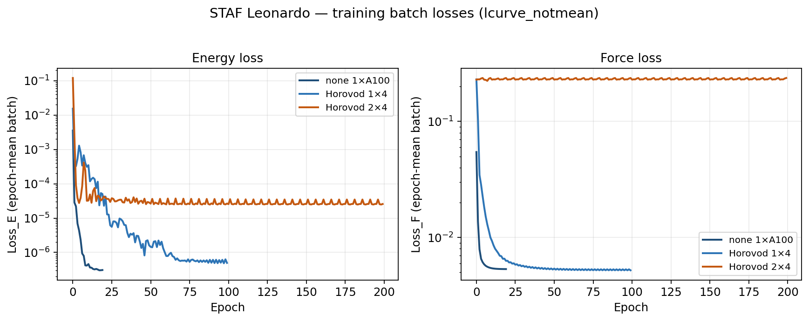
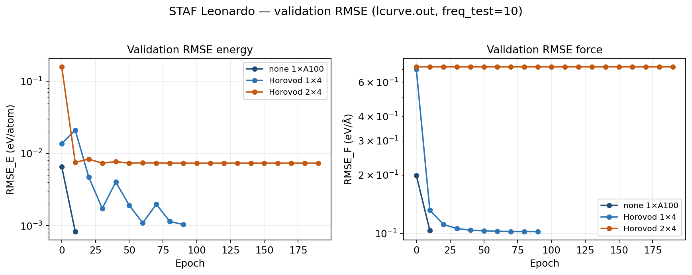
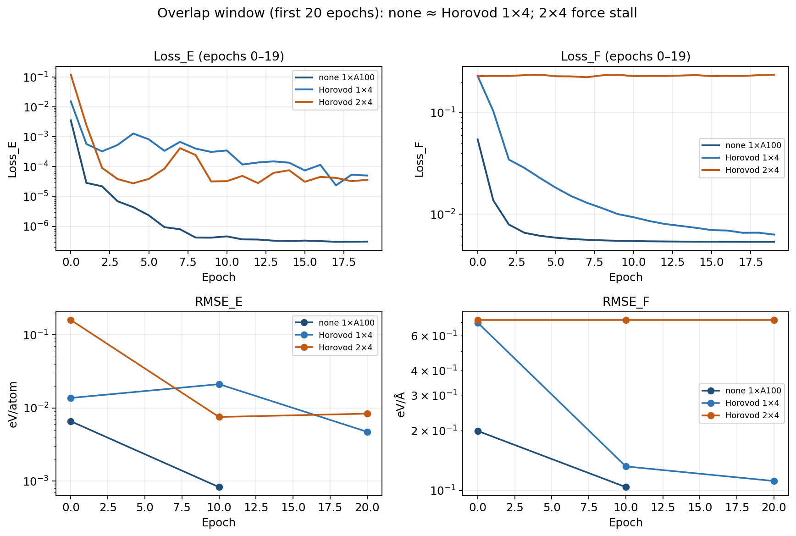

# STAF

**STAF** — Soft Two-body Angular Fingerprint deep neural network potential for water and biomolecular systems.


> DOI: **10.1063/5.0139245**

Official code: **`STAF/`** (one tree; precision from YAML):

```bash
cd STAF
bash install_path.sh all          # builds ops_float + ops_double from src/
python staf_train.py input_staf.yaml   # precision: float|double
```

**Linea B (LAMMPS, in progress):** default MD path is **ONNX + ONNX Runtime** for the Dense MLP; custom CUDA stays in `libstaf`. See [`test/B_ARCHITECTURE.md`](test/B_ARCHITECTURE.md), [`libstaf/`](libstaf/), [`lammps/USER-STAF/`](lammps/USER-STAF/). Export:

```bash
python STAF/save_models/export_mlp_onnx.py -imodel model_log0 -modelname model_onnx
```

Experimental variants remain under `DEV/` (not part of the A2 full-atom unify).

See `STAF/README.md`, `test/ACCEPTANCE.md`, and `test/A2_PROGRESS.md`.

## Performance baseline (reference)

Measured on **Tesla V100-PCIE-16GB** (driver 470.256.02, CUDA 11.8, TensorFlow 2.14) with the MB-pol water test in `test/test-training-pipeline/run_{float,double}` (`dataset_MBPOL_278_223_248_full`).

| Quantity | Value |
| --- | --- |
| Atoms | 768 (256 O + 512 H) |
| Box | orthorhombic, \(L \approx 19.5\)–\(19.7\) Å |
| Cutoffs | \(R_c = R_c^\mathrm{ang} = 4.5\) Å, \(R_s = 2.25\) Å |
| Mean neighbors within \(R_c\) | **38.2 ± 0.8** (40-frame sample, MIC PBC) |
| Neighbor buffers | `Radial_Buffer` = `Max_Angular_Neigh` = 60 |
| Batch | `batch_size = 4`, `buffer_stream_dim_tr = 4`, energy+force |

| Precision | Per frame | Frames / s | Per batch (4 frames) | ≈ train / epoch (120 steps) |
| --- | --- | --- | --- | --- |
| **float32** | **91.5 ms** | 10.9 | 0.366 s | ≈ 44 s |
| **float64** | **149.7 ms** | 6.7 | 0.599 s | ≈ 72 s |

float64 / float32 wall-time ratio on this workload: **≈ 1.64×**.

Raw logs: `test/test-training-pipeline/comparison/performance_baseline.txt`.

## Leonardo multi-GPU benchmarks (Horovod)

Measured on **CINECA Leonardo** (`boost_usr_prod`, QoS `boost_qos_lprod`, account `AIFAC_F02_652`), campaign `jobs/bench_20260724` (2026-07-24/25). Full MB-pol float dataset, `batch_size = 8`, `buffer_stream_dim_tr = 8`, energy+force, neighbor buffers 60.

### HPC configuration

| Item | Value |
| --- | --- |
| GPU | **NVIDIA A100-SXM-64GB** (sm_80), 4 GPUs / node |
| Software | Python 3.10, TensorFlow **2.14**, Horovod **0.28.1** (NCCL allreduce) |
| Modules | `gcc/12.2.0`, `cuda/12.2`, `cudnn/8.9.7`, `nccl/2.22.3`, `openmpi/4.1.6` |
| Ops | `STAF/ops_float` built for **sm_80** |
| Launch | 1 Python rank / GPU via `srun`; 8 CPUs / task; `--cpu-bind=none` |
| Dataset | `mbpol_full_float` (`subsampling: no`), \(R_c = R_c^\mathrm{ang} = 4.5\) Å, \(R_s = 2.25\) Å |

| Run | Job | Nodes | GPUs | Epochs | Chief host | Job wall |
| --- | --- | --- | --- | --- | --- | --- |
| `distribute: none` | 50159734 | 1 | 1 | 20 | `lrdn2975` | 50.1 min |
| Horovod **1×4** | 50159735 | 1 | 4 | 100 | `lrdn1473` | 62.7 min |
| Horovod **2×4** | 50159736 | 2 | 8 | 200 | 2× boost nodes | 63.6 min |

### Steady-state results

Throughput from `time_story.dat` full `BATCH` windows (wall 3.5–8 s; first compile window excluded). Epoch times: mean train wall for epochs ≥ 1. For Horovod, `global_frames = displ_freq × batch_size × n_ranks`.

| Run | Global frames / s | ms / global frame | Train / epoch | Speedup | Parallel eff. |
| --- | --- | --- | --- | --- | --- |
| none 1×A100 | **16.25 ± 0.05** | 61.5 | **147.7 ± 0.1 s** | 1.00× | 100% |
| Horovod 1×4 | **64.93 ± 0.18** | 15.4 | **36.9 ± 0.4 s** | **4.00×** | **99.9%** |
| Horovod 2×4 | **131.97 ± 3.91** | 7.6 | **18.5 ± 0.3 s** | **8.12×** | **101.5%** |


### Loss / RMSE parity (same physics?)

Overlay of `lcurve_notmean` (epoch-mean batch `Loss_E` / `Loss_F`) and test-set `RMSE_E` / `RMSE_F` from `lcurve.out` (`freq_test = 10`). Units: energy eV/atom, forces eV/Å.

| Run | Final epoch-mean Loss_E / Loss_F | Late val. RMSE_E / RMSE_F |
| --- | --- | --- |
| none 1×A100 (ep 19 / val ep 10) | 3.1×10⁻⁷ / **0.00534** | 8.3×10⁻⁴ / **0.104** |
| Horovod 1×4 (ep 99 / val ep 90) | 5.0×10⁻⁷ / **0.00522** | 1.0×10⁻³ / **0.102** |
| Horovod 2×4 (ep 199 / val ep 190) | 2.6×10⁻⁵ / **0.237** (stalled) | 7.3×10⁻³ / **0.719** (stalled) |

**none** and **Horovod 1×4** reach the same force plateau (batch `Loss_F` ≈ 5.3×10⁻³, `RMSE_F` ≈ 0.103 eV/Å). **Horovod 2×4** kept throughput scaling but **did not train forces** in this campaign (then LR was auto-scaled ×`hvd.size()` → 0.008; force loss flat). That ×N LR policy has been **removed** — Horovod now keeps the YAML learning rates. Re-run 2×4 recommended with unchanged YAML LR (optionally `batch_size: 4` for global batch 32).







Raw numbers and Slurm details: `test/test-training-pipeline/comparison/leonardo_multigpu_baseline.txt`. Source runs under `/leonardo_work/AIFAC_F02_652/STAF-test/jobs/bench_20260724/`.

## Citation

If you use this code, please cite:

```
Francesco Guidarelli Mattioli, Federico Dogo, Franz Saija, and Marco Fabrizio,
"A Soft Two-body Angular Fingerprint approach for the development of neural network potentials for water and biomolecular systems",
J. Chem. Phys. 158, 104101 (2023). https://doi.org/10.1063/5.0139245
```
