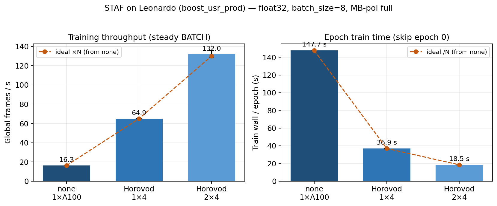
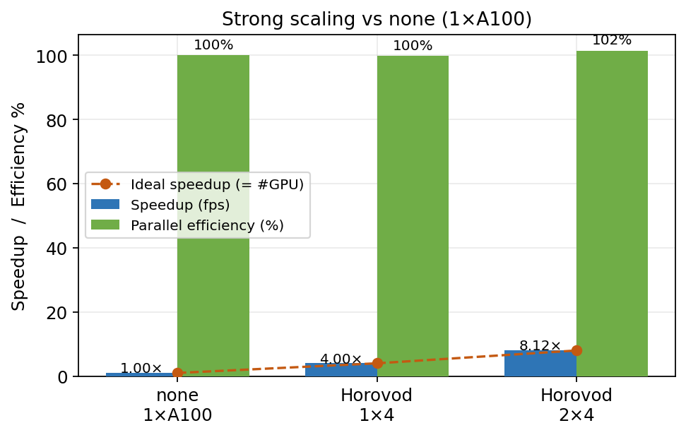
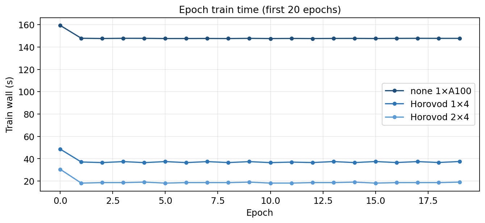
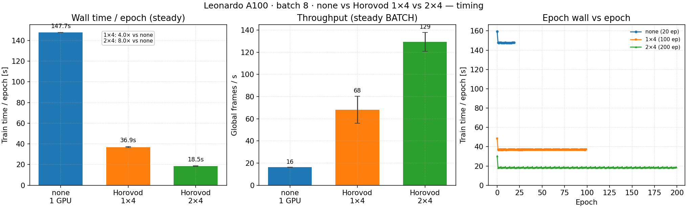
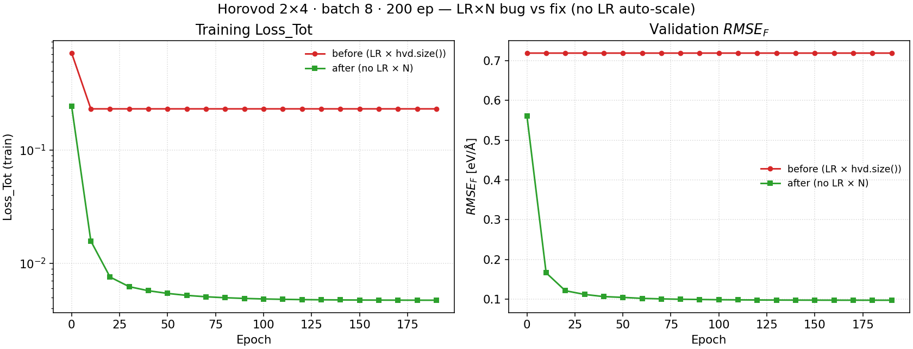
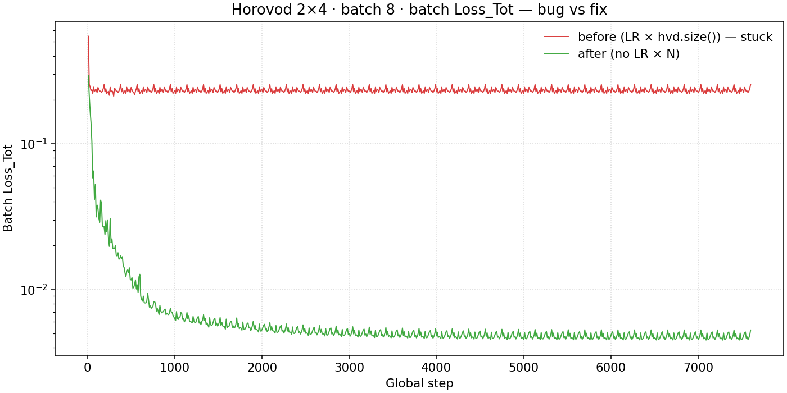
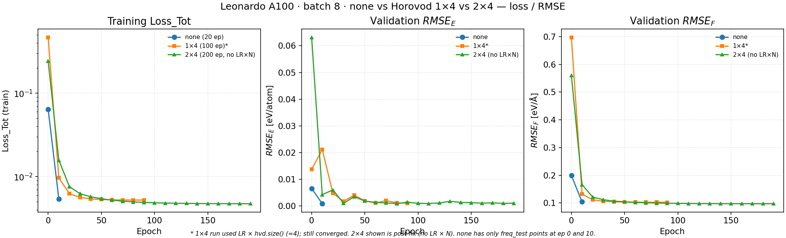
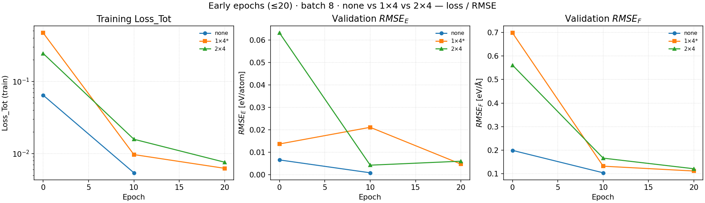
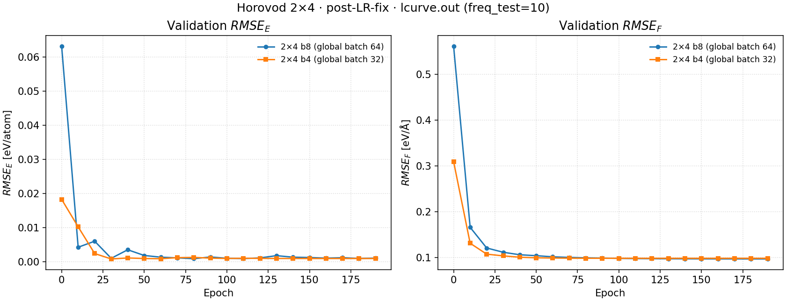

# STAF-AI Potential

**STAF-AI Potential — Self Trained Atomic Fingerprint AI Potential**


> DOI: **10.1063/5.0139245**

Official code: **`STAF/`** (one tree; precision from YAML):

```bash
cd STAF
bash install_path.sh all          # builds ops_float + ops_double from src/
python staf_train.py input_staf.yaml   # precision: float|double
```

**Linea B (LAMMPS, in progress):** default MD path is **ONNX + ONNX Runtime** for the Dense MLP; custom CUDA stays in `libstaf`. See [`test/B_ARCHITECTURE.md`](test/B_ARCHITECTURE.md), [`libstaf/`](libstaf/), [`lammps/USER-STAF/`](lammps/USER-STAF/). Export:

```bash
python STAF/save_models/export_mlp_onnx.py -imodel model_log0 -modelname model_onnx
```

Experimental variants remain under `DEV/` (not part of the A2 full-atom unify).

**STAF-CG** (origami dual-cutoff, in progress): official tree [`STAF-CG/`](STAF-CG/), sprint checklist [`DEV/STAF_CG_SPRINTS.md`](DEV/STAF_CG_SPRINTS.md). DEV `AlphaNesGpu_double_CG_dv_RC/` is the freeze, not the working copy.

See `STAF/README.md`, `test/ACCEPTANCE.md`, `test/A2_PROGRESS.md`, and the living plan [`docs/PIANO_ALPHANES.md`](docs/PIANO_ALPHANES.md).

## Performance baseline (reference)

Measured on **Tesla V100-PCIE-16GB** (driver 470.256.02, CUDA 11.8, TensorFlow 2.14) with the MB-pol water test in `test/test-training-pipeline/run_{float,double}` (`dataset_MBPOL_278_223_248_full`).

| Quantity | Value |
| --- | --- |
| Atoms | 768 (256 O + 512 H) |
| Box | orthorhombic, \(L \approx 19.5\)–\(19.7\) Å |
| Cutoffs | \(R_c = R_c^\mathrm{ang} = 4.5\) Å, \(R_s = 2.25\) Å |
| Mean neighbors within \(R_c\) | **38.2 ± 0.8** (40-frame sample, MIC PBC) |
| Neighbor buffers | `Radial_Buffer` = `Max_Angular_Neigh` = 60 |
| Batch | `batch_size = 4`, `buffer_stream_dim_tr = 4`, energy+force |

| Precision | Per frame | Frames / s | Per batch (4 frames) | ≈ train / epoch (120 steps) |
| --- | --- | --- | --- | --- |
| **float32** | **91.5 ms** | 10.9 | 0.366 s | ≈ 44 s |
| **float64** | **149.7 ms** | 6.7 | 0.599 s | ≈ 72 s |

float64 / float32 wall-time ratio on this workload: **≈ 1.64×**.

Raw logs: `test/test-training-pipeline/comparison/performance_baseline.txt`.

## Leonardo multi-GPU benchmarks (Horovod)

Measured on **CINECA Leonardo** (`boost_usr_prod`, QoS `boost_qos_lprod`, account `AIFAC_F02_652`). Full MB-pol float dataset, `batch_size = 8`, `buffer_stream_dim_tr = 8`, energy+force, neighbor buffers 60.

- Timing / first campaign: `jobs/bench_20260724` (2026-07-24/25)
- Loss fix re-run (no `LR × hvd.size()`): `jobs/bench_post-LR-not-scaling-fix` (2026-07-25)

### HPC configuration

| Item | Value |
| --- | --- |
| GPU | **NVIDIA A100-SXM-64GB** (sm_80), 4 GPUs / node |
| Software | Python 3.10, TensorFlow **2.14**, Horovod **0.28.1** (NCCL allreduce) |
| Modules | `gcc/12.2.0`, `cuda/12.2`, `cudnn/8.9.7`, `nccl/2.22.3`, `openmpi/4.1.6` |
| Ops | `STAF/ops_float` built for **sm_80** |
| Launch | 1 Python rank / GPU via `srun`; 8 CPUs / task; `--cpu-bind=none` |
| Dataset | `mbpol_full_float` (`subsampling: no`), \(R_c = R_c^\mathrm{ang} = 4.5\) Å, \(R_s = 2.25\) Å |

| Run | Job | Nodes | GPUs | Epochs | Notes |
| --- | --- | ---: | ---: | ---: | --- |
| `distribute: none` | 50159734 | 1 | 1 | 20 | baseline |
| Horovod **1×4** | 50159735 | 1 | 4 | 100 | first campaign |
| Horovod **2×4** (LR × 8, stalled) | 50159736 | 2 | 8 | 200 | first campaign |
| Horovod **2×4** (no LR × N) | 50222273 | 2 | 8 | 200 | post-fix, batch 8 |
| Horovod **2×4** (no LR × N) | 50222274 | 2 | 8 | 200 | post-fix, batch 4 |

### Steady-state timing (none vs 1×4 vs 2×4)

Throughput from `time_story.dat` full `BATCH` windows (first compile window excluded). Epoch times: mean train wall for epochs ≥ 1. For Horovod, `global_frames = displ_freq × batch_size × n_ranks`.

| Run | Global frames / s | ms / global frame | Train / epoch | Speedup | Parallel eff. |
| --- | --- | --- | --- | --- | --- |
| none 1×A100 | **16.25 ± 0.05** | 61.5 | **147.7 ± 0.1 s** | 1.00× | 100% |
| Horovod 1×4 | **64.93 ± 0.18** | 15.4 | **36.9 ± 0.4 s** | **4.00×** | **99.9%** |
| Horovod 2×4 | **131.97 ± 3.91** | 7.6 | **18.5 ± 0.3 s** | **8.12×** | **101.5%** |









### Loss / RMSE (after removing LR × N)

In the first 2×4 campaign, auto-scaling LR by `hvd.size()` (×8) stalled force training (`Loss_Tot` ≈ 0.23, \(RMSE_F\) ≈ 0.72). That policy is **removed**: Horovod keeps the YAML learning rates. Re-run 2×4 then matches none / 1×4.

| Run | Late val. RMSE_E / RMSE_F | Late Loss_Tot | Status |
| --- | --- | --- | --- |
| none 1×A100 (val ep 10) | 8.3×10⁻⁴ / **0.104** | ≈ 0.0054 | OK |
| Horovod 1×4 (val ep 90) | 1.0×10⁻³ / **0.102** | ≈ 0.0052 | OK |
| Horovod 2×4 before (LR × 8, ep 190) | 7.3×10⁻³ / **0.719** | ≈ 0.231 | stalled |
| Horovod 2×4 after (no LR × N, b8, ep 190) | 1.0×10⁻³ / **0.097** | ≈ 0.0047 | OK |
| Horovod 2×4 after (no LR × N, b4, ep 190) | 9.3×10⁻⁴ / **0.099** | ≈ 0.0049 | OK |











First-campaign overlays (include stalled 2×4): `assets/leonardo_multigpu_loss.png`, `assets/leonardo_multigpu_rmse.png`, `assets/leonardo_multigpu_loss_rmse_overlay.png`.

Raw numbers: `test/test-training-pipeline/comparison/leonardo_multigpu_baseline.txt`.  
Leonardo workdir for runs (not the git source of truth): `/leonardo_work/AIFAC_F02_652/STAF-test/jobs/`.

## Citation

If you use this code, please cite:

```
Guidarelli Mattioli, F., Sciortino, F., & Russo, J. (2023).
A neural network potential with self-trained atomic fingerprints: A test with the mW water potential.
The Journal of Chemical Physics, 158(10), 104101.
https://doi.org/10.1063/5.0139245
```
