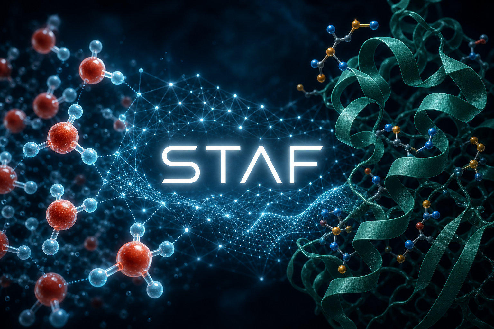

# STAF

**STAF** — Soft Two-body Angular Fingerprint deep neural network potential for water and biomolecular systems.



> DOI: **10.1063/5.0139245**

GPU implementations for single and double precision live in `AlphaNesGpu_float` and `AlphaNesGpu_double`. Experimental models are under `DEV/`.

Usage and installation docs will be rewritten as the repository is reorganized.

## Citation

If you use this code, please cite:

```
DOI: 10.1063/5.0139245
```

## License

BSD 3-Clause License

## Contact

francesco.guidarellimattioli@gmail.com
