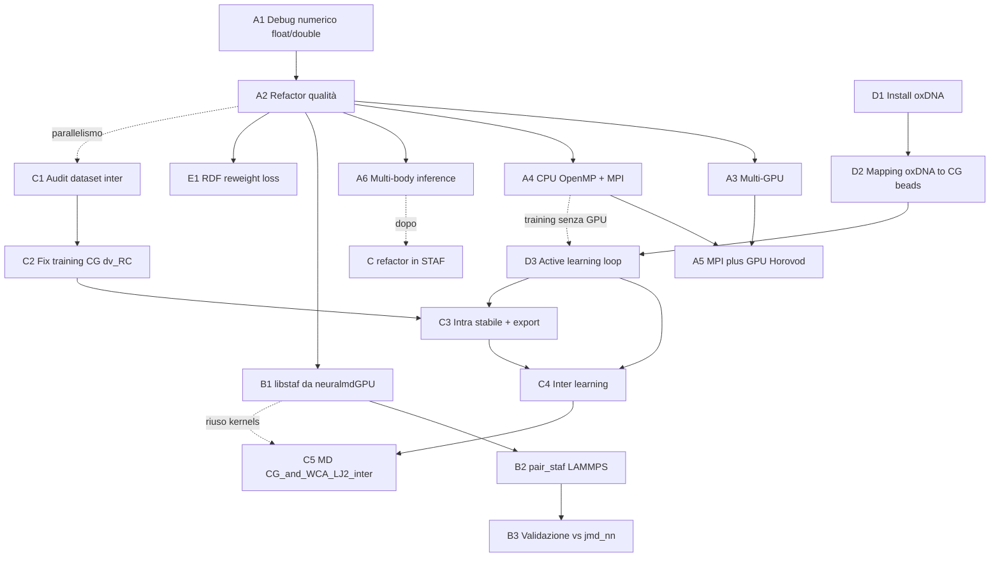
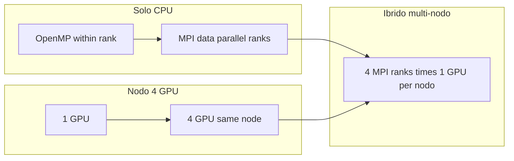
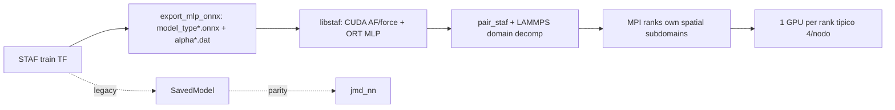
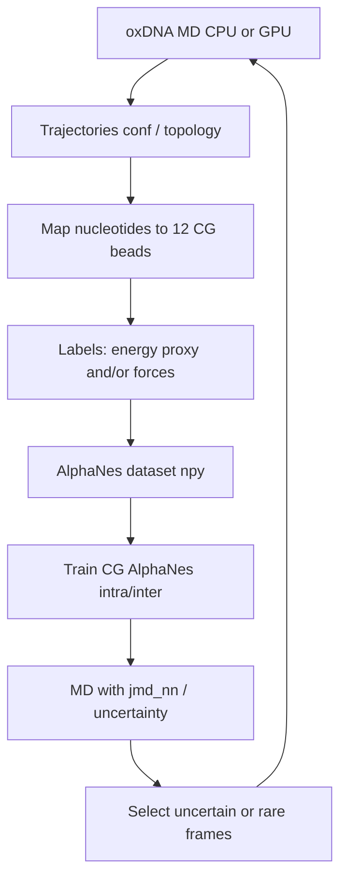

# Piano di lavoro: AlphaNesGpu (debug / qualità / parallelismo) → LAMMPS STAF → CG Origami + oxDNA AL → learning da osservabili macroscopiche (RDF)

**Autore contesto:** Francesco Guidarelli Mattioli  
**Data piano:** 2026-07-22  
**Aggiornamenti:** 2026-07-24 parallelismo CPU/MPI + oxDNA AL; 2026-08-19 linea **E** (RDF/reweighting) + **A6** (decomposizione multi-body in inference); 2026-08-19 avvio port **STAF-CG/** (linea C, checklist [`DEV/STAF_CG_SPRINTS.md`](../DEV/STAF_CG_SPRINTS.md)).  
**Copia canonica:** questo file in `docs/PIANO_ALPHANES.md` (repo `AlphaNesGpu`). Non lasciare copie sparse in `$HOME`.

**Scope:** cinque linee di lavoro collegate.

**Nota numerazione A5 vs A6.** Nel piano originale **A5 = Horovod MPI+GPU** (già wired + benchmark Leonardo). La decomposizione multi-body in inference è **A6** per non sovrascrivere A5. Il port CG ufficiale è **`STAF-CG/`** (sibling di `STAF/`, non fuso in `STAF/src/`); sprint in [`DEV/STAF_CG_SPRINTS.md`](../DEV/STAF_CG_SPRINTS.md).

---

## 0. Obiettivi e visione d’insieme

| Linea | Obiettivo | Deliverable |
|-------|-----------|-------------|
| **A** | Debug + qualità + **parallelizzazione** di **AlphaNes** (float/double): multi-GPU, **CPU (OpenMP + MPI)**, **MPI+GPU**, e **decomposizione multi-body** in inference | Repo unico; regressione; training scalabile; `staf_infer --decompose` |
| **B** | Patch **LAMMPS** con potenziale neurale **STAF / AlphaNes**, esecuzione da grafo come `neuralmdGPU`, parallelismo MD con **domain decomposition Allegro-style** | `pair_style staf` MPI-capable (come `pair_allegro`) + esempi water su nodi multi-GPU |
| **C** | Riprendere lo sviluppo **CG AlphaNes** per **DNA origami**: consolidare **intra**, sbloccare **inter**; port ufficiale in **`STAF-CG/`** (dopo A6) | Tree `STAF-CG/` + `pair_style staf/cg`; modelli intra stabili in MD + inter che impara (RMSE_f ≪ 39) |
| **D** | Installare **oxDNA** e chiudere il loop di **active learning** per generare i dati CG mancanti (soprattutto inter / sticky / unbound) | oxDNA (+ GPU se disponibile) installato; pipeline oxDNA→dataset AlphaNes; loop AL funzionante |
| **E** | Learning da **osservabili macroscopiche** (RDF / g(r), poi altre): loss con **reweighting** (prototipo in `DEV/AlphaNesGpu_double_RDF`) | Training STAF con termine RDF reweighted; latex della loss da FGM (in attesa) |



**Regola di priorità consigliata**

1. **A1** subito (bug numerici già identificati bloccano affidabilità).  
2. **C1–C2** e **D1** in parallelo (diagnostica inter + install oxDNA indipendenti dal multi-GPU).  
3. **A2** prima di **A3/A4/A5** e **B** (senza codice consolidato, parallelismo e patch LAMMPS moltiplicano il debito).  
4. **A4 (CPU/MPI)** subito dopo A2 per chi lavora senza GPU; **A3** per nodi GPU; **A5** quando entrambi sono solidi.  
5. **B** dopo aver congelato il contratto di export **ONNX** (MLP standard: E + ∂E/∂AF) + runtime **ONNX Runtime** in `libstaf` (vedi §3; SavedModel resta riferimento legacy/`jmd_nn`).  
6. **D2–D3** alimentano **C3–C4** (dati mancanti → retrain); possono girare in parallelo alle campagne inter già avviate.  
7. **A6** (decomposizione multi-body inference) sul tree `STAF/` **prima** del refactor CG.  
8. **E** (RDF / reweighting) può procedere in parallelo a C/D una volta che il latex della loss è in repo; prototipo già in `DEV/AlphaNesGpu_double_RDF`.

---

## 1. Mappa del codice rilevante (stato attuale)

### 1.1 Training STAF / AlphaNes (full-atom)

| Path | Ruolo |
|------|--------|
| `/home/francegm/AlphaNesGpu/AlphaNesGpu_float/` | Training GPU float32 |
| `/home/francegm/AlphaNesGpu/AlphaNesGpu_double/` | Training GPU float64 (repo ufficiale) |
| `/home/francegm/AlphaNesGpu_double_local/` | Working copy double (path CUDA locali, arch spesso `sm_70`) |
| `/home/francegm/AlphaNesCPU/` | Riferimento CPU / regressione; già ha **OpenMP** nei custom op e `alpha_nes_threads` per TF |
| Entry: `alpha_nnpes_full_main.py` | Training |
| Export: `save_models/save_model.py` | Keras → SavedModel `model_type{k}` + ASCII AF |
| Inference Python: `alphanes_models/mixture/alpha_nes_model_inference.py` | Energy/force check |

**YAML tipici:** `input_alphanes.yaml`, `input_mbpol_*.yaml`  
**Chiavi chiave:** `Rc`, `Rs`, `Rc_Angular`, `map_rad_afs`, `map_ang_afs`, `loss_*`, `type_of_training`, `lr_*`.

### 1.2 MD con grafo TF (da riusare per LAMMPS)

| Path | Ruolo |
|------|--------|
| `/home/francegm/neuralmdGPU/full_atom/` | MD full-atom + TF C API |
| `/home/francegm/neuralmdGPU/CG/` | MD CG |
| `/home/francegm/neuralmdGPU/DEV/CG_and_WCA_LJ2_inter/` | MD origami con inter cutoffs + WCA |
| Core: `src/nn_nn.cu` | Load SavedModel, `TF_SessionRun`, pipeline CUDA |

**Contratto runtime attuale**

1. Descrittori + AF su CUDA (`src_nn/descriptor_builder`, `fingerprint`, `force`).  
2. Hop host: AF GPU→host → `TF_SessionRun` su `serving_default_des` → `StatefulPartitionedCall` (E, ∂E/∂AF).  
3. Forze: CUDA chain-rule da ∂E/∂AF.  
4. Modello: directory `model_type{k}/` (tag `serve`) + `type{k}_alpha_{2,3}body.dat` (+ emb se multi-type).

**Benchmark esistente:** `/home/francegm/perf_dpmdvsSTAF/` (DeepMD `graph.pb` vs STAF `MODEL684`).

### 1.3 LAMMPS (nessun pair STAF oggi)

| Path | Pattern utile |
|------|----------------|
| `/home/francegm/programmi/lammps-23Jun2022/` | Build `lmp_mpi_mbx` |
| `/home/francegm/programmi/MBX/plugins/lammps/USER-MBX/` | Template USER-package + `pair`/`fix` |
| `ML-HDNNP` / `pair_hdnnp` | Template “libreria NN esterna” |
| `ML-IAP` | Meno adatto (riscriverebbe i descrittori STAF) |
| DeepMD | Solo via conda + `pair_style deepmd`; non in-tree |

Nota: un clone `lammps` sotto home può essere presente/assente a seconda della macchina; il tree operativo documentato è sotto `programmi/lammps-23Jun2022*`.

### 1.4 CG Origami

| Path | Ruolo |
|------|--------|
| `/home/francegm/ORIGAMI/` | Dataset, training, inferenza, dinamiche |
| `/home/francegm/AlphaNesGpu/DEV/AlphaNesGpu_double_CG/` | CG base |
| `/home/francegm/AlphaNesGpu/DEV/AlphaNesGpu_double_CG_dv_RC/` | CG con **dual cutoff** intra/inter (**trainer da usare per inter**) |
| `/home/francegm/AlphaNesGpu_double_CG_local/` | Working copy CG (YAML spesso incompleto) |

**Sistema fisico:** DNA origami CG — **12 bead / origami**, dimeri **24 bead**, sticky sites (color), `map_intra` per molecola.

**Evidenza empirica (da `lcurve.out`)**

- Intra (es. `training_thousand_CGMODEL/RUN2`): force RMSE può scendere ~**0.05**, poi rischio esplosione / collasso legame in MD.  
- Inter (`RUN_INTER*` su `dataset_inter`): force RMSE piatto ~**39.09** per migliaia di epoche → il canale inter **non impara**.

---

## 2. Linea A — Debug, qualità, parallelismo (float + double; nodi fino a 4 GPU)

### A1. Debug numerico e funzionale (settimane 1–2)

Obiettivo: rendere float e double **scientificamente affidabili** e allineati, prima di ottimizzare.

#### A1.1 Bug già noti da correggere (priorità alta)

| ID | Sintomo / codice | Azione |
|----|------------------|--------|
| D1 | In double, kernel CUDA usano `expf(...)` e letterali `0.f` su buffer `double` (es. `AlphaNesGpu_double/src/mixture/fingerprint/rad/reforce.cu.cc`, `grad_*`) | Sostituire con `exp` / `0.0`; audit completo `expf|0\.f` su tutto il tree double |
| D2 | In `alpha_nes_model.py` double: `loss_force` ancora `dtype='float32'` in path energy-only | Uniformare a `float64` |
| D3 | CG: `full_train_e` può riferire `loss_force` non definito | Fix NameError; test `type_of_training: energy` |
| D4 | `opt_phys` costruito ma gradienti AF spesso applicati solo via `opt_net` (“MODIFICA 19.04”) | Decidere: un optimizer o due; documentare e allineare float/double |
| D5 | `type_emb_*` ricevono grad custom ma **non** vengono aggiornati nel training loop | O li si allena, o si congelano esplicitamente e si rimuove rumore nei grad |
| D6 | README cita `alpha_nnpes_full_inference_main.py` inesistente | Allineare docs a `example_inference/simple_inference.py` |
| D7 | Path hardcoded (`root_path`, shebang miniconda, Leonardo) | Solo via `install_path.sh` / env var `ALPHANES_ROOT` |
| D8 | Export incompleto: `cutoff_info` / mappe non sempre scritte da `save_model` training | Unificare export training ↔ `save_models/save_model.py` ↔ contratto `neuralmdGPU` |

#### A1.2 Suite di regressione (obbligatoria prima del refactor)

Creare cartella `tests/` (o `regression/`) con:

1. **CPU vs GPU vs float vs double** su un mini-dataset (pochi frame mW o MB-pol):  
   - energia totale, forze, ∂E/∂AF su un batch fisso con seed fissato.  
2. **Parity export:** modello addestrato → SavedModel →  
   - Python inference  
   - `jmd_nn` (`neuralmdGPU/full_atom`)  
   Tolleranze: float ~1e-4–1e-5 (rel), double più strette su energy.  
3. **Mixture smoke test:** 2 specie, AF cross-type non banali.  
4. **Compile matrix:** TF 2.14 + CUDA 11.8 (stack attuale in `programmi/`), compute capability da `get_compcap.py` (vietare arch hardcoded nei tree “ufficiali”).

Comandi di accettazione (da formalizzare in script):

```bash
# esempio concettuale
python tests/test_energy_force_parity.py --precision double --tol 1e-8
python tests/test_export_vs_jmd.py --model MODEL684 --frames 5
```

#### A1.3 Debug operativo (checklist)

- [ ] Riprodurre training corto float e double su stesso dataset seedato; confrontare learning curve (non devono divergere “a caso”).  
- [ ] Verificare overflow buffer angolari (`Max_Angular_Neigh`) → messaggio chiaro, non abort silenzioso.  
- [ ] Controllare `alpha_bound` + ReLU: loggare max(α) per epoca.  
- [ ] Memory growth già presente: aggiungere report `nvidia-smi` / TF memory all’inizio epoca.  
- [ ] Documentare bug float-specifici (se emergono da parity).

**Criterio di uscita A1:** parity test green; nessun `expf` su path double; export produce tutto ciò che `jmd_nn` richiede.

---

### A2. Qualità del codice e consolidamento (settimane 2–5)

Obiettivo: **una sola codebase** parametrizzata su precisione e (poi) su full-atom vs CG, invece di N alberi gemelli.

#### A2.1 Strategia di consolidamento consigliata

```
AlphaNesGpu/
  alphanes/                 # Python package unico
    train.py
    model/
    layers/
    export/
  cuda/                     # sorgenti .cu.cc con typedef / template PRECISION
  configs/
  tests/
  AlphaNesGpu_float/        # (transitorio) thin wrapper o symlink
  AlphaNesGpu_double/
  DEV/                      # esperimenti CG / RDF isolati
```

**Passi:**

1. **Freeze** del tree ufficiale float/double come tag git `pre-refactor`.  
2. Introdurre macro/template CUDA `real` = `float`|`double` (un solo albero `src/`).  
3. Unificare Python: `dtype` da YAML (`precision: float|double`) + `keras.backend.set_floatx`.  
4. Eliminare `sed` su `root_path`: usare path relativi al package o env.  
5. Separare **DEV CG** ma condividere descriptor/AF/export dove possibile.  
6. CI locale minima: compile float + double + 2 smoke tests.

#### A2.2 Debito tecnico da rimuovere / isolare

- File morti: `alpha_nes_full_virial_mod_old.py`, serial leftover, `descriptor_builder_develop` non wired (o documentarlo come experimental).  
- Duplicazione local vs ufficiale: policy “upstream = `AlphaNesGpu/`, local solo override di `local.env`”.  
- Inference: un solo entrypoint CLI (`alphanes infer ...`).  
- Logging strutturato (RMSE_e/f, max force err, lr, α stats) in CSV/JSON stabile al posto di sole print.

#### A2.3 Performance training (single-GPU, prima del multi-GPU)

Queste ottimizzazioni aiutano anche A3:

| Item | Nota |
|------|------|
| Evitare sync inutili nei custom op (`cudaDeviceSynchronize` solo dove serve) | Profilare con Nsight |
| Pipeline dataset: overlap H2D descrittori / train | `tf.data` o double-buffer già parziale via `buffer_stream_dim_*` |
| Fusionare dove possibile log-norm + dense in grafo XLA (opzionale, dopo correttezza) | `jit_compile` solo su parte Keras |
| Batch size sweep documentato per VRAM | Tabella N_atom × batch × precision |

**Criterio di uscita A2:** un comando installa float **o** double; test di regressione passano su entrambi; codice CG non rompe il path full-atom.

---

### A3–A5. Parallelizzazione: multi-GPU (nodi a 4 GPU), CPU (OpenMP+MPI), MPI+GPU

**Hardware di riferimento:** molti nodi HPC (es. Leonardo booster) hanno **4 GPU per nodo**. Oggi AlphaNes ne usa tipicamente **1** e lascia le altre idle → il target di A3/A5 è **saturare il nodo intero (4/4 GPU)**, non fermarsi al test su 2.

**Stato oggi**

| Livello | Training AlphaNes | MD (`neuralmdGPU` / futuro LAMMPS) |
|---------|-------------------|-------------------------------------|
| Single GPU | Sì (default TF) | Sì |
| Multi-GPU stesso nodo (**fino a 4**) | **No** (`tf.distribute` assente) | No |
| CPU multi-thread | Parziale in **AlphaNesCPU** (`OpenMP` + `alpha_nes_threads`) | OpenMP in `programmi/neural_md` |
| MPI multi-nodo / multi-rank | **No** | No in JMD; sì in LAMMPS (dopo linea B) |
| MPI + 1 GPU/rank (4 rank/nodo) | **No** | Target naturale post-B / A5 |

Motivazione: **non tutti hanno GPU** → path CPU first-class; su nodi GPU il default HPC è **usare tutte e 4** (o via MirroredStrategy same-node, o via **4× MPI rank × 1 GPU**).



**Due modi equivalenti per saturare un nodo a 4 GPU**

| Modo | Come | Quando preferirlo |
|------|------|-------------------|
| **A3 — same-process multi-GPU** | `MirroredStrategy` / 4 replica TF nello stesso job | Debug semplice, 1 processo, un nodo |
| **A5 — 4 MPI rank × 1 GPU** | `mpirun -np 4` + `CUDA_VISIBLE_DEVICES` per local_rank | Produzione Slurm, estensione multi-nodo (8, 16, … GPU) |

Entrambi devono raggiungere **4/4 GPU utilizzate**; A5 è anche il ponte al multi-nodo.

---

### A3. Parallelizzazione multi-GPU sullo stesso nodo — **CHIUSA (Horovod only, 2026-08-19)**

**Stato oggi:** `MirroredStrategy` **rimosso** dal codice. Multi-GPU ufficiale = **Horovod (A5)**, validato su Leonardo 1×4 e 2×4. A3 resta come prep CUDA per-device + decisione “no mirrored”.

#### A3.1 Scelta architetturale (storica; superseduta da Horovod)

| Opzione | Pro | Contro | Verdetto |
|---------|-----|--------|----------|
| **Data parallel + `MirroredStrategy` su 4 GPU** | Standard TF; un job = un nodo | Custom op device-aware; sync NCCL | **Prima scelta same-node** |
| Horovod / NCCL, 4 rank locali | Stesso codice di A5; scala a più nodi | Più glue | **Alternativa preferita se si salta subito ad A5** |
| Model parallel (split reti per specie) | Utile se N_types grande | Poco ROI su water | Dopo, se serve |
| Multi-GPU solo su MD | Utile a runtime | Non accelera training | Linea B |

**Piano MirroredStrategy (concreto, nodo 4 GPU)**

1. Isolare la parte “pura TF” (dense + loss) vs custom op CUDA.  
2. 4 replica: ogni GPU riceve `batch_size_local` frame; **global batch = 4 × batch_size_local**.  
3. Descrittori/AF per replica sulla GPU locale; `strategy.run(train_step)`.  
4. Custom op su `op.device` / stream della GPU corrente (niente `static` global non indexed by device).  
5. Allreduce gradienti via NCCL tra le 4 GPU; AF come `tf.Variable` replicate.  
6. Scaling misurato **1 → 2 → 4 GPU sullo stesso nodo** (non fermarsi a 2).  
7. Job Slurm tipico: `#SBATCH --gres=gpu:4` (o equivalente Leonardo: 4 GPU allocate), un solo task o 1 task che vede tutte le GPU.

**Target di efficienza (batch-limited, global batch scalato)**

| GPU usate | Speed-up minimo vs 1 GPU | Note |
|-----------|--------------------------|------|
| 2 | ≥ 1.5× | smoke |
| **4** | ≥ **2.8×** | **acceptance del nodo pieno** (~70% scaling) |

#### A3.2 Ostacoli (acuiti a 4 GPU)

- Stato globale nei `.cu.cc` / singleton Python delle op libraries (a 4 device esplode subito).  
- `RegisterGradient` sotto strategia.  
- Buffer irregolari: sizing **per replica** (VRAM × 4).  
- NCCL / peer-to-peer su PCIe vs NVLink: misurare allreduce time.  
- Checkpoint da replica 0 compatibile con export.  
- Bit-reproducibility non garantita (documentare).  
- Evitare che TF “veda” 4 GPU ma alleni solo su `/gpu:0` (verificare con `nvidia-smi` durante il run).

#### A3.3 Criteri di accettazione multi-GPU (nodo a 4)

- [ ] Loss a **4 GPU** ≈ 1 GPU a **stesso global batch**.  
- [ ] Smoke a 2 GPU + **acceptance a 4 GPU** (speed-up ≥ 2.8×).  
- [ ] `nvidia-smi` mostra utilizzo/memoria su **tutte e 4** durante il train step.  
- [ ] Export SavedModel invariato nel formato.  
- [ ] YAML/env: `devices: [0,1,2,3]` / `CUDA_VISIBLE_DEVICES=0,1,2,3`.  
- [ ] Script esempio `train_4gpu.sh` per nodo pieno.

---

### A4. Parallelizzazione CPU: OpenMP + MPI (settimane 4–8, prioritaria per chi non ha GPU)

Obiettivo: rendere **AlphaNesCPU** (e, dopo A2, il backend CPU del tree unificato) usabile su laptop/cluster **senza GPU**, con scaling decente.

#### A4.1 Livello 1 — OpenMP / thread TF (quick win, basato sull’esistente)

Già presente in `/home/francegm/AlphaNesCPU/`:

- env `alpha_nes_threads` → `tf.config.threading.set_{inter,intra}_op_parallelism_threads`  
- `#pragma omp parallel for` nei custom op forza (es. `op_force_and_pressure_3bAFs.cc` + `setOMPthreads`)

**Da fare**

1. Audit: **tutti** i custom op CPU pesanti (descriptor, fingerprint rad/ang, force, grad) devono rispettare `OMPThreadsNum` (oggi può essere solo su alcuni file).  
2. YAML: `num_threads: 8` (oltre all’env var); default = `OMP_NUM_THREADS`.  
3. Documentare binding: `OMP_PROC_BIND=close`, evitare oversubscription TF threads × OpenMP.  
4. Benchmark: 1 vs 8 vs 16 core su mini-dataset; target ≥ 5× su 8 core per la parte op (non necessariamente end-to-end).  
5. Allineare float/double CPU allo stesso schema thread dopo A2.

#### A4.2 Livello 2 — MPI data-parallel sul training (frame sharding)

Pattern classico (come molti trainer ML potenziali):

```
mpirun -np N python alpha_nnpes_full_main.py input.yaml
```

Ogni rank:

1. Legge lo stesso YAML; shard del training set (`frame_id % size == rank`).  
2. Forward/backward locale (OpenMP dentro il rank).  
3. **Allreduce** dei gradienti (pesi dense + parametri AF) ogni step / ogni few steps.  
4. Rank 0: logging, checkpoint, export.

**Stack consigliato (in ordine di prova)**

| Stack | Quando |
|-------|--------|
| **Horovod** (`hvd.DistributedOptimizer`) o **tensorflow.distribute MultiWorker** via MPI | Se si resta in TF eager/graph Python |
| **mpi4py** + allreduce manuale su `tape.gradient` | Più controllo; utile con custom op ostici |
| Processi indipendenti + average checkpoint (async / elastic) | Solo fallback “povero”; non per produzione |

**Dettagli implementativi**

- Descrittori: ogni rank calcola solo i suoi frame → scaling di memoria e CPU naturale.  
- Batch globale = `batch_size_local × n_ranks` (documentare learning-rate scaling: linear o sqrt).  
- Test set: valutare su rank 0 oppure allgather metriche.  
- I/O dataset: preferire `mmap` già usato + indici per rank; evitare che ogni rank carichi tutto in RAM.  
- CG origami: stesso schema (i frame dimer sono indipendenti).

#### A4.3 Criteri di accettazione CPU/MPI

- [ ] Training CPU-only end-to-end documentato (no CUDA required).  
- [ ] OpenMP: speed-up misurato e tabella in README.  
- [ ] MPI 2 e 4 rank: loss confrontabile a 1 rank a parità di **global batch**.  
- [ ] Speed-up MPI ≥ 1.6× su 2 rank (dataset abbastanza grande da non essere I/O-bound).  
- [ ] Checkpoint rank 0 ricaricabile in run single-process.

---

### A5. MPI + GPU — unità di base = **nodo a 4 GPU** (settimane 8–11)

Pattern HPC standard: **1 processo MPI × 1 GPU**. Su nodi con **4 GPU** il run di default è:

```bash
#SBATCH --nodes=1
#SBATCH --gres=gpu:4          # o --gpus-per-node=4 su Leonardo
#SBATCH --ntasks-per-node=4
srun python alpha_nnpes_full_main.py input.yaml   # 4 rank, 1 GPU ciascuno
```

Poi si scala a **2 nodi = 8 GPU**, **4 nodi = 16 GPU**, ecc., senza cambiare il modello di parallelismo.

#### A5.1 Architettura

1. Partire da A4 (sharding frame + allreduce gradienti).  
2. Ogni rank: `local_rank = hvd.local_rank()` (o equivalente) → una sola GPU visibile.  
3. Custom op CUDA solo sulla GPU del rank; **un processo non spezza le 4 GPU** (più semplice di MirroredStrategy×MPI).  
4. Allreduce gradienti via **NCCL** tra le 4 GPU del nodo (e tra nodi); fallback MPI host se serve.  
5. Parità funzionale con A3 sullo stesso hardware: **4 GPU same-node via MPI** deve dare metriche equivalenti a **MirroredStrategy su 4 GPU**.

**Perché ha senso rispetto a solo MirroredStrategy**

- Stesso codice scala a **più nodi da 4 GPU** senza riscrivere.  
- Allineato a Slurm (`ntasks-per-node=4` + 4 GPU).  
- Path unico con A4: cambia solo il device.

**Matrice di test A5 (obbligatoria)**

| Config | Rank × GPU | Cosa verifica |
|--------|------------|---------------|
| 1×1 | 1 rank, 1 GPU | baseline |
| 2×1 | 2 rank / 2 GPU stesso nodo | smoke NCCL |
| **4×1** | **4 rank / 4 GPU stesso nodo** | **acceptance nodo pieno** |
| 8×1 | 2 nodi × 4 GPU | multi-nodo |

#### A5.2 MD runtime (complementare al training)

| Engine | MPI | GPU | Nota |
|--------|-----|-----|------|
| `jmd_nn` oggi | No | 1 GPU | Restyle dopo libstaf |
| LAMMPS + `pair_staf` | Sì (nativo) | 1 GPU/rank; tipico 4 rank/nodo | **Via principale** MD parallela |
| CPU MD `programmi/neural_md` | No / OpenMP | No | Smoke senza GPU |

**Distinzione importante (training vs MD)**

| Contesto | Parallelismo giusto | Non fare |
|----------|---------------------|----------|
| **Training AlphaNes (A3–A5)** | Data-parallel su **frame** (ogni rank/GPU un sotto-batch di configurazioni) | Domain decomposition spaziale sui atomi di un frame |
| **MD runtime (linea B)** | **Domain decomposition spaziale** LAMMPS come **Allegro** (`pair_allegro`): ogni rank possiede un sottovolume + ghost | Reinventare DD dentro `jmd_nn`; o fingere che “1 GPU = sistema intero” basti per sistemi grandi |

**Perché nel training la DD (tipo Allegro) di solito non vale la pena**

1. **Asse naturale = batch di configurazioni indipendenti**, non lo spazio di un singolo frame. Frame A e frame B non si parlano: zero ghost tra di loro → data-parallel quasi “gratis” fino all’allreduce dei pesi.  
2. **I gradienti sui parametri della rete sono globali per costruzione.** Anche se spacchi *un* frame in subdomain, alla fine sommi comunque ∂L/∂θ su tutto il sistema e poi (in mini-batch) medi su più frame/rank. La DD non “tiene i gradienti separati”: SGD *vuole* che si mescolino. Paghi comunicazione ghost + allreduce pesi, senza guadagno statistico.  
3. **I sistemi di training STAF/origami sono piccoli** (acqua: centinaia–migliaia di atomi; origami CG: 12–24 bead). La DD paga quando N è enorme (memoria/compute per config); qui il collo di bottiglia è il numero di frame/epoche, non la taglia del singolo snapshot.  
4. **Unico caso in cui rivedere:** training su configurazioni così grandi che **non stanno in VRAM** su una GPU. Allora la DD diventa un vincolo di memoria, non una strategia di ottimizzazione migliore del data-parallel. Non è il caso tipico AlphaNes attuale.

Priorità MD parallela: **linea B con DD Allegro-style**. Training: **restare su data-parallel (A3–A5)**. `jmd_nn` resta riferimento single-rank.

#### A5.3 Criteri di accettazione MPI+GPU

- [ ] **4 rank × 1 GPU sullo stesso nodo**: parity loss vs 1 GPU (global batch fisso) + speed-up ≥ 2.8×.  
- [ ] Smoke 2 rank; estensione documentata a 2 nodi (8 GPU) se disponibili.  
- [ ] Job Slurm di esempio `train_mpi_4gpu.sh` (nodo pieno) + `train_mpi_2node.sh`.  
- [ ] Nessun deadlock NCCL; shutdown pulito TF session.  
- [ ] Doc: tabella “CPU-only / 1 GPU / **4 GPU/nodo (A3 o A5)** / multi-nodo MPI+GPU”.

---

### A6. Decomposizione multi-body in inference (2026-08-19)

Obiettivo: spezzare l’energia STAF come se nel mondo esistessero **solo n particelle alla volta**.

Per il termine **n-body**: ogni insieme di n atomi (clique: tutte le coppie a distanza MIC ≤ `rcut`) viene messo **da solo nel vuoto**; si calcola l’energia STAF di quel sistema a n corpi; si **somma** su tutti gli insiemi. Solo energie (niente forze/viriale).

`rcut` default = `max(Rc, Rc_ang)`. Senza cutoff, C(N,n) è ingestibile; coppie oltre cutoff hanno AF ≈ 0.

```bash
python STAF/staf_infer.py --model MODEL --precision float --pos pos.npy --box box.npy \
  --decompose --max-body 3
# --max-body 5   # anche 4- e 5-body (molti cluster)
# --max-clusters 20   # smoke
```

Le somme **non** sono l’MBE con inclusione-esclusione: l’energia di un trimero isolato contiene già le coppie. Non devono sommare a `E_full`.

**TODO(FGM):** formula **chiusa** del 2-body (parametri AF ↔ fisica microscopica) — latex da riportare in `docs/`. Fino ad allora i parametri α non vengono dumpati da `--decompose`.

- [x] Cluster isolati n=2..5, somma energie, CLI `--decompose`.  
- [ ] Latex 2-body chiuso in `docs/` e implementazione della formula.  

---

## 3. Linea B — Patch LAMMPS per STAF / AlphaNes (con domain decomposition tipo Allegro)

### B0. Principio guida

**Non riscrivere STAF dentro ML-IAP.**  
Estrarre una **libreria C++/CUDA** (`libstaf`) e collegarla a LAMMPS come USER-package.

**Backend MLP di default (congelato 2026-07-24):** **ONNX + ONNX Runtime (ORT)**.

| Pezzo | Dove vive | Runtime |
|-------|-----------|---------|
| Descriptor / AF / force CUDA | `libstaf` (da `STAF/src` + `neuralmdGPU`) | CUDA custom |
| MLP standard (lognorm + Dense) | export `.onnx` per tipo | **ORT** (CUDA EP) |
| Glue LAMMPS | `lammps/USER-STAF` | chiama solo `staf_*` |

Catena per step MD:

```text
pos/ghost → CUDA AF → ORT(AF→E, ∂E/∂AF) → CUDA force kernels → LAMMPS F/virial
```

Training resta **TensorFlow**. Export ufficiale MD: `STAF/save_models/export_mlp_onnx.py` (non custom op nel `.onnx`).  
SavedModel + TF C API restano **riferimento legacy** per parity vs `jmd_nn`, non il path default LAMMPS.

Doc in-repo: `AlphaNesGpu/test/B_ARCHITECTURE.md`, scaffold `libstaf/`, `lammps/USER-STAF/`.

**Template da seguire (in ordine di rilevanza per il parallelismo MD):**

| Riferimento | Cosa prendere |
|-------------|----------------|
| **`pair_allegro`** ([mir-group/pair_nequip_allegro](https://github.com/mir-group/pair_nequip_allegro)) | **Domain decomposition MPI**: modello *strictly local* → multi-rank; ghost atoms; 1 GPU/rank; (opz.) Kokkos per evitare H↔D |
| USER-MBX / `PairHDNNP` | Packaging USER-*, lifetime libreria esterna, `pair`/`fix` |
| `neuralmdGPU` | Kernel CUDA AF/force; contratto E/∂E/∂AF (oggi via SavedModel) |
| ONNX Runtime | Loader `.onnx` + CUDA EP (anello MLP in `libstaf`) |

Perché Allegro e non “solo MPI generico”: NequIP message-passing è limitato a **1 rank**; Allegro è locale e quindi **scala con la DD di LAMMPS**. **STAF è analogo ad Allegro sul punto decisivo**: descrittori 2b/3b a cutoff finito, nessun message passing multi-hop → **deve supportare domain decomposition multi-rank/multi-GPU come `pair_allegro`**, non un MVP single-rank con MPI “dopo”.



### B1. Estrarre `libstaf` (settimane 4–6, dopo A2 minimo)

**Layout monorepo**

```text
AlphaNesGpu/
  STAF/                 # training + export ONNX
  libstaf/              # C API runtime (CUDA + ORT)
  lammps/USER-STAF/     # pair_staf glue
  test/B_ARCHITECTURE.md
```

**API C minima** (DD: `nlocal` / `nghost` / `nall`) — vedi `libstaf/include/staf.h`.

```c
typedef struct StafModel StafModel;
StafModel* staf_load(const char* model_dir, const StafOptions* opt);
void staf_compute(StafModel* m,
                  int nlocal, int nghost,
                  const double* x,          // [nall*3], nall = nlocal+nghost
                  const double* box,        // triclinic 6 o 9
                  const int* type,
                  double* e_atom_or_total,
                  double* f,                // [nall*3]; ghost → reverse_comm
                  double* virial);          // 6
void staf_free(StafModel* m);
```

**MLP pluggable** (`staf_mlp_*`): default backend ORT; TF C API / native Dense come opzioni future senza toccare `pair_staf`.

**Contratto export ONNX (per tipo atomico `k`)**

- Input: `af` shape `[batch, n_atoms_k, n_AF_k]` (o `[N, n_AF]` documentato).  
- Output: `energy` (per batch / somma tipo), `dE_daf` stesso rank di `af`.  
- Grafo = `log(af+ε)-μ` + Dense Keras + `tf.gradients` già materializzati (come `save_models/save_model.py`).  
- File tipici in `model_dir/`: `model_type{k}.onnx`, `type{k}_alpha_{2,3}body.dat`, `type{k}_alpha_mu.dat` (μ può essere baked nell’ONNX).

**Requisiti di località (contratto Allegro-like)**

1. Energia/forza di un atomo `i` locale dipendono solo da vicini entro `max(Rc, Rc_Angular)` (+ ghost).  
2. Nessuna riduzione globale che richieda tutto il sistema dentro `staf_compute` (oltre alla somma energia/viriale del rank).  
3. Tripletti angolari: tutti i membri del tripletto devono essere in `nlocal∪nghost` → **comm cutoff** ≥ cutoff angolare.  
4. Ogni rank: propria sessione ORT + buffer GPU (modello read-only).

**Sorgenti da portare (full_atom prima):**

- Kernel: `STAF/src` (descriptor, fingerprint, force) e/o mirror da `neuralmdGPU`  
- MLP: `libstaf/src/mlp/*` + link **ONNX Runtime** (CUDA EP)  
- Legacy opzionale: glue TF da `neuralmdGPU/full_atom/src/nn_nn.cu` solo per parity

**Migliorie performance (DD + 4 GPU/nodo)**

1. Ridurre D2H/H2D intorno a ORT (IOBinding device pointers se possibile).  
2. Riciclare buffer I/O ORT tra step.  
3. Opzionale: TensorRT EP — non blocca MVP.  
4. Verificare presto **FP64** con ORT+CUDA; se insufficiente, backend native Dense per double.

### B2. Package LAMMPS `USER-STAF` / `ML-STAF` + domain decomposition (settimane 6–10)

**File da creare:**

| File | Ruolo |
|------|--------|
| `pair_staf.h/.cpp` | `PairStyle(staf, PairSTAF)`; `compute()` su subdomain; MPI-safe |
| `fix_staf.h/.cpp` | Lifetime `libstaf` / ORT session, model dir, buffer GPU **per rank** |
| `Install.sh` | Copia in `src/` |
| `Makefile.mpi_staf` | CUDA / ORT / `libstaf` (base MPI come `mpi_mbx`) |

**Input script target (water, già multi-rank)**

```lammps
units           real
atom_style      atomic
pair_style      staf 6.0 6.0      # cut rad, cut ang
pair_coeff      * * /path/to/MODEL684
# ghost: LAMMPS DD; eventualmente
comm_modify     cutoff 6.0       # >= max cutoff STAF
```

Run tipico nodo 4 GPU (come Allegro/Kokkos practice):

```bash
#SBATCH --nodes=1 --ntasks-per-node=4 --gres=gpu:4
srun lmp_mpi_staf -in in.staf_water
# ogni rank: subdomain spaziale + 1 GPU
```

#### B2.1 Domain decomposition — design obbligatorio (non “fase 2”)

Allinearsi a **`pair_allegro`**, non a `pair_nequip` (1-rank only):

| Aspetto | Comportamento richiesto |
|---------|-------------------------|
| Decomposizione | Quella nativa LAMMPS (`comm->cut`, brick/tiled) |
| Ghost | Vicini oltre il bordo di dominio entro cutoff STAF; skin + reneighbor |
| `compute()` | Loop / kernel solo su `nlocal`; neighbor list include ghost |
| Forze | Accumulo su ghost → `reverse_comm` (Newton on) |
| Energia/viriale | Contributi locali + `MPI_Allreduce` di termodinamica (LAMMPS) |
| GPU | **1 GPU per rank MPI** (4 rank = 4 subdomain = 4 GPU sullo stesso nodo) |
| Multi-nodo | Stesso schema; più subdomain, più ghost traffic |

**Neighbor list**

- **Obbligatorio per DD:** usare la neighbor list LAMMPS (full o half + Newton) e convertirla nei buffer STAF (`with` / `howmany` / dist2).  
- **Vietato in produzione multi-rank:** cell-list JMD costruita solo su `nlocal` senza ghost.  
- Verificare che i triplet angolari usino indici ghost corretti (bug classico nei potenziali 3-body sotto DD).

**Checklist implementativa “come Allegro”**

- [ ] `init_style`: richiedere neighbor request full/ghost adeguato al 3-body.  
- [ ] `comm_forward` / ghost positions aggiornate ogni reneighbor.  
- [ ] Nessun `MPI_Allgather` di posizioni di tutto il sistema dentro `pair_staf`.  
- [ ] Test: sistema grande (≫ cutoff) su 1 vs 2 vs **4 rank** — energia totale e forze (su atomi comuni) entro tolleranza.  
- [ ] Scaling weak/strong: 1→4 GPU/nodo; poi 2 nodi.  
- [ ] Documentare differenza vs DeepMD (altro pair) e vs Allegro (stesso *pattern* DD, diverso backend: **ORT/ONNX + CUDA STAF** vs Torch).

**Nota Kokkos:** Allegro usa Kokkos per tenere pair+model on-device. Per STAF MVP non è obbligatorio riscrivere in Kokkos; sì è obbligatorio il **contratto DD/ghost**. Un path “device-resident” può arrivare dopo, sul modello delle loro ottimizzazioni H↔D.

### B3. Validazione e regressione

Suite:

1. **Single-rank:** MODEL684 energie/forze vs `jmd_nn` (`perf_dpmdvsSTAF/STAF`).  
2. **DD correctness:** stesso sistema, 1 vs 2 vs 4 rank — E totale, temperature media NVT.  
3. **4 GPU/nodo:** weak scaling (più atomi) e strong scaling (stesso N).  
4. Timing vs DeepMD opzionale.  
5. Unità, masse, type map documentati.

**Criterio di uscita B:** parity single-rank con `jmd_nn` **e** domain decomposition corretta a **4 rank / 4 GPU**; README con esempio Allegro-style (`srun` multi-GPU).

### B4. Estensione CG (dopo MVP water, allineata a linea C)

`pair_style staf/cg` **esiste** (Sprint 6): package [`lammps/USER-STAF-CG/`](../lammps/USER-STAF-CG/), runtime [`libstaf_cg/`](../libstaf_cg/), binary `lmp_staf_cg` (non sostituisce `lmp_staf`). Gate: `test/test-lammps-staf-cg-parity/` — stesso frame 24 bead, LAMMPS vs Python STAF-CG su energia, forze e pressione configurazionale (solo pair virial). Intra `Rc=50` Å ⇒ `comm_modify cutoff 50`. DD 1 vs 2 vs 4 rank (una V100, rank che condividono la GPU). WCA/LJ extras non sono nel pair; restano `hybrid` se servono. Scientific C4 (inter RMSE) è ancora dopo questo wiring.

---

## 4. Linea C — CG AlphaNes per Origami (intra OK-ish, inter bloccato)

**Port ufficiale:** [`STAF-CG/`](../STAF-CG/) (Sprint 1–5 closed 2026-08-19; checklist [`DEV/STAF_CG_SPRINTS.md`](../DEV/STAF_CG_SPRINTS.md)). `DEV/AlphaNesGpu_double_CG_dv_RC/` resta freeze. Gate Python: `bash test/test-cg-pipeline/run_sprint3.sh`. **LAMMPS:** `pair_style staf/cg` (`lammps/USER-STAF-CG/`, `lmp_staf_cg`) — Sprint 6, parity E/F/P_config in `test/test-lammps-staf-cg-parity/`.

### C0. Diagnosi sintetica

| Aspetto | Intra | Inter |
|---------|-------|-------|
| Trainer | CG / a volte dv_RC | **`AlphaNesGpu_double_CG_dv_RC`** |
| Dataset | `training_thousand*`, dimer BOUND | `dataset_inter` = total − intra_pred (`subtract.py`) |
| AF map tipica | split canali per NN/color | `{0:[0,0,10]}` solo canale sticky/inter |
| Force RMSE | fino ~0.05 (poi instabile) | **~39.09 piatto** |
| MD | `neuralmdGPU/DEV/CG_and_WCA_LJ2_inter` | dipende da modelli inter inutili oggi |

**Ipotesi ordinate da falsificare (C1)**

1. Residui inter quasi ovunque ~0; picchi sticky non allineati al canale AF `[0,0,*]`.  
2. Kernel CUDA: coppie `map_intra[i] != map_intra[j]` non popolano il canale AF usato.  
3. Label contaminata: intra model scarso ⇒ residual = errore intra, non fisica inter.  
4. Loss: solo forze + batch grandi diluiscono contatti sticky rari.  
5. Capacità rete `[25,25]` insufficiente / cutoff inter mal dimensionato (`Rc_Inter=20` vs bond sticky).

### C1. Audit dataset e canale inter (settimana 1–2, parallelo ad A1)

Checklist concreta:

- [ ] Istogramma ‖F_inter‖ per bead e per distanza sticky (9–16); frazione frame con contatto.  
- [ ] Dump di un frame: descrittori/AF **solo inter** non tutti zero.  
- [ ] Confrontare `force_inter` da `INFER_INTRA_TRY2+USCGSITE/subtract.py` con `total - F_intra(model_buono)` usando il miglior checkpoint RUN2 (non MODEL con RMSE_f~38).  
- [ ] Verificare coerenza `map_color_interaction.dat`, `color_map_type.dat`, sticky colors.  
- [ ] Unit test CUDA: una coppia inter-color nota → contributo AF canale 2 > 0.

**Script da aggiungere** (in `ORIGAMI/tools/`): `audit_inter_residuals.py`, `probe_af_channel.py`.

### C2. Stabilizzare il trainer CG dv_RC (settimane 2–4)

Su `/home/francegm/AlphaNesGpu/DEV/AlphaNesGpu_double_CG_dv_RC/`:

- Allineare YAML: `color_interaction_file`, `map_intra_file`, `activation_function` come lista.  
- Portare fix numerici di A1 (`exp` vs `expf`, dtype).  
- Logging per-canale: loss/grad norm su AF intra vs inter.  
- Opzionale: loss pesata sui bead sticky / frame con contatto.  
- Ripristinare energy term piccolo (`loss_energy_prefactor > 0`) come regolarizzatore.

### C3. Intra: qualità “production” (parallelo / subito dopo C2)

1. Selezionare finestra di epoche buona (pre-esplosione RUN2).  
2. Early stopping su force RMSE + check strutturale (distanza sticky in short MD).  
3. Export completo → cartella tipo `MODEL_INTRA_STABLE/`.  
4. Rigenerare `dataset_inter` con **quel** modello (invalidare i residual vecchi).  
5. Documentare iperparametri WCA (`Sigma_WCA`, `Eps_WCA`) che non combattano la rete.

### C4. Inter: campagna di learning (settimane 4–8)

Protocollo sperimentale a griglia piccola ma sistematica:

| Asse | Valori da provare |
|------|-------------------|
| Target | residual da intra-stable; vs force totali solo su frame bound |
| AF | `[0,0,10]`, `[0,0,20]`, aggiungere angolari sticky |
| Net | `[25,25]`, `[64,64]`, due NN (come intra BOUND) |
| Cutoff inter | 16 / 20 / 30; `Rc_Angular_Inter` non 3 salvo test dedicati |
| Loss | force-only pesata; energy+force; huber δ sweep |
| Dati | USCGSITE 91k vs subset “solo near-contact” |

**Criterio di uscita C4:** force RMSE inter almeno **ordine di grandezza** sotto 39 (target iniziale &lt; 5–10 a seconda della scala delle forze sticky), learning curve non piatta entro ~100 epoche.

### C5. MD end-to-end origami

- Engine: `neuralmdGPU/DEV/CG_and_WCA_LJ2_inter/jmd_nn`  
- Test: dimero box 280, T di riferimento delle campagne `ORIGAMI_DYNAMICS`  
- Metriche: stabilità sticky bond, g(r) picco sticky, no collasso, no esplosione  
- Solo dopo: considerare `pair_staf/cg` in LAMMPS (B4)

**Nota dati:** le campagne C3–C5 vanno integrate con la **linea D** (oxDNA + active learning) appena il mapping bead è stabile: i buchi del dataset (inter, unbound, rare sticky) non si risolvono solo con reweighting dei 91k frame esistenti.

---

## 5. Linea D — oxDNA + active learning per dati CG mancanti

### D0. Perché serve

Il training CG origami è limitato da **copertura dello spazio delle configurazioni**, non solo dall’architettura:

- Intra impara su monomeri/dimeri già visti; in MD il sticky bond può collassare (regioni fuori distribuzione).  
- Inter resta a RMSE_f ~39: residuali sparsi / mal etichettati **e** pochi esempi di binding/unbinding “fisici”.  
- Serve un **generatore di traiettorie** dedicato al DNA origami a grana fine (nucleotide), poi **proiettato** sul modello a 12 bead usato da AlphaNes.

**oxDNA** ([lorenzo-rovigatti/oxDNA](https://github.com/lorenzo-rovigatti/oxDNA), docs: [install](https://lorenzo-rovigatti.github.io/oxDNA/install.html)) è lo strumento naturale: modello CG DNA/RNA (oxDNA2), MD CPU/GPU, binding Python `oxpy`, ecosystem per origami.



### D1. Installazione oxDNA (settimana 1–2, subito)

Target path suggerito: `/home/francegm/programmi/oxDNA` (allineato a MBX/LAMMPS/TF).

```bash
cd /home/francegm/programmi
git clone https://github.com/lorenzo-rovigatti/oxDNA.git
cd oxDNA && mkdir build && cd build

# CPU-only (macchine senza GPU)
cmake .. -DPython=ON
make -j$(nproc) && make install   # oxpy + analysis tools

# oppure con GPU NVIDIA
cmake .. -DCUDA=1 -DPython=ON
make -j$(nproc) && make install

# smoke
./bin/oxDNA --version   # o run example da ../examples
make test_run           # se disponibile nel build
```

**Deliverable D1**

- [ ] Binari `oxDNA`, `DNAnalysis`, `confGenerator` in `build/bin`.  
- [ ] `import oxpy` nell’env conda usato per AlphaNes (o env dedicato `oxdna`).  
- [ ] Un esempio origami/tutorial eseguito end-to-end (anche piccolo).  
- [ ] Modulo/env documentato per Leonardo (compiler + eventuale CUDA).  
- [ ] Nota: esiste anche `pair_oxdna` in LAMMPS — **separato** dal standalone; per AL preferire lo standalone (+ `oxpy`) salvo scelta esplicita di unificare tutto in LAMMPS dopo linea B.

### D2. Mapping oxDNA → modello CG AlphaNes a 12 bead (settimane 2–4)

Punto delicato: AlphaNes origami lavora su **12 siti CG / origami** con `map_intra`, `color_type_map`, sticky (bead 9–16 nel dimero). oxDNA lavora a **livello nucleotide**.

**Task**

1. Formalizzare la mappa geometrica: quali nucleotidi → quale bead (COM per dominio/helical patch, o schema già usato in `NEW10TRAJ_ORIGAMI` / generatori `gen_random_conf.py`).  
2. Script `oxdna_to_alphanes_cg.py`:  
   - input: topology + trajectory oxDNA  
   - output: `pos.npy`, `box.npy`, e (se definiti) target energia/forza nel formato AlphaNes  
3. Rigenerare `map_intra.dat` / `color_*.dat` automaticamente dal topology.  
4. Validare su 1–2 traiettorie già presenti in `ORIGAMI/` (stesse statistiche g(r) sticky, RMSF per bead).  
5. Decidere la **fonte delle label**:  
   - **A (consigliata per bootstrap):** distillazione / force-matching rispetto a un potenziale effettivo sulle bead (oxDNA → forze proiettate sui COM, o forze da un modello teacher già usato nei dataset storici);  
   - **B:** self-consistency (MD AlphaNes + correzione);  
   - **C:** solo sampling geometrie da oxDNA + label da teacher JMD/intra già buono per residual inter.

Senza D2 solido, l’active learning riempie il dataset di spazzatura.

### D3. Loop di active learning (settimane 4–10)

Obiettivo: produrre i **dati mancanti** (contatti sticky rari, unbound, near-miss, temperature diverse) invece di oversampling sempre le stesse 10 traiettorie.

#### D3.1 Protocollo AL (MVP)

1. **Train** modello CG corrente (intra e/o inter) sul dataset esistente.  
2. **Explore** con oxDNA (e/o con `jmd_nn` se il modello è già usabile) ensemble di dimer/monomer a T e box rilevanti.  
3. **Score** configurazioni candidate:  
   - incertezza ensemble (2–3 reti / dropout) su forze;  
   - e/o distanza sticky fuori bucket storici;  
   - e/o alto residual ‖F_inter‖ rispetto al modello.  
4. **Label** i frame selezionati (proiezione oxDNA + teacher / force projection).  
5. **Merge** in `dataset/` / `dataset_inter/` con bilanciamento bound/unbound.  
6. **Retrain** (ripartire da `only_afs` o full restart a seconda della stabilità).  
7. Ripetere finché RMSE_f inter scende e MD non collassa.

#### D3.2 Infrastruttura software (cartelle proposte)

```
/home/francegm/ORIGAMI/active_learning/
  README.md
  env_oxdna.md
  mapping/oxdna_to_alphanes_cg.py
  select/score_uncertainty.py
  select/score_sticky_coverage.py
  jobs/run_oxdna_ensemble.sh
  jobs/relabel_and_merge.py
  rounds/round_000/ ...
```

Parallelismo utile qui (collegamento ad A4/A5):

- Molte traiettorie oxDNA **embarrassingly parallel** (1 job = 1 seed) via Slurm/MPI launcher.  
- Relabel/training AlphaNes sulle nuove chunk con **MPI CPU** o GPU a seconda della macchina.  
- oxDNA GPU per origami grandi; CPU sufficiente per dimer 2×origami se si lanciano tanti seed.

#### D3.3 Criteri di accettazione linea D

- [ ] oxDNA install riproducibile (CPU obbligatorio, GPU opzionale).  
- [ ] ≥1 round AL completo: oxDNA → map → merge → retrain → metrica inter/intra migliorata o coverage sticky ↑.  
- [ ] Dataset aumentato con frazione misurabile di frame near-contact / unbound nuovi.  
- [ ] Documentato come i 12 bead si ottengono dai nucleotidi (figura + script).  
- [ ] Hook nel piano C: `dataset_inter` rigenerato dopo ogni round AL, non solo da `subtract.py` sui vecchi frame.

---

## 6. Linea E — Learning da osservabili macroscopiche (RDF / reweighting)

Obiettivo: addestrare (o fine-tunare) STAF non solo su E/F/W microscopici ma su **quantità termodinamiche / strutturali**, in primis la **RDF** g(r).

**Precedente:** `DEV/AlphaNesGpu_double_RDF/` — kernel RDF + `calculate_gr_reweight.c` (istogramma pesato con `ΔE · β`, i.e. reweighting della traiettoria al potenziale aggiornato).

**Tecnica:** reweighting della loss (stesso spirito di WHAM / perturbation: configurazioni campionate con H_0, osservabile e pesi `exp(−β(U_θ − U_0))`). FGM conosce il metodo; **i calcoli in latex saranno forniti e poi implementati**. Fino ad allora: solo questa linea nel piano, **niente loss RDF nel tree `STAF/`**.

#### E1. Scope (quando arriva il latex)

- [ ] Trascrivere la loss reweighted in `docs/` (latex → nota implementativa).  
- [ ] Portare RDF/reweight da `DEV/AlphaNesGpu_double_RDF` nel tree `STAF/` (stesso schema A2).  
- [ ] YAML: pesi loss RDF vs E/F/V; `beta`; coppie di tipo (OO/OH/HH).  
- [ ] Gate: g(r) su un mini-set confrontabile col prototipo DEV.

**Dipendenze:** A2 (tree unico). Non blocca B. Parallelo a C/D. Dopo E1 si può usare g(r) anche come metrica post-MD (già prevista in `STAF_sweep_md`).

---

## 7. Piano temporale suggerito (12–14 settimane, flessibile)

| Settimane | A | B LAMMPS | C Origami CG | D oxDNA + AL | E RDF |
|-----------|---|----------|--------------|--------------|-------|
| 1–2 | A1 debug + regression | — | C1 audit inter | **D1 install oxDNA** | — |
| 3–4 | A2 consolidamento; **A4 OpenMP audit** | B1 API libstaf | C2 trainer + C3 intra | **D2 mapping bead** | — |
| 5–6 | A2 chiusura; A4 MPI 2-rank; A3 smoke 2 GPU | B1 parity vs jmd_nn | C4 inter + dati D | D2 freeze; prototipo select | — |
| 7–9 | **A3/A5** 4 GPU/nodo (Horovod fatto) | B2 `pair_staf` + **DD Allegro** | C4→C5 | **D3 round AL #1–2** | attesa latex |
| 10–12 | **A6** decompose inference; poi refactor CG→STAF | B3 scaling DD | Freeze modelli | D3 round #3 | E1 se latex pronto |
| 13–14 (buffer) | Release tag A | B4 CG opzionale | MD produzione | Automazione rounds | RDF in STAF |

---

## 8. Dipendenze, rischi e mitigazioni

| Rischio | Impatto | Mitigazione |
|---------|---------|-------------|
| Custom op non compatibili con `MirroredStrategy` | Blocca A3 | Fallback A5-style: 1 processo/GPU + allreduce (Horovod/mpi4py); o solo A4 CPU |
| Oversubscription TF × OpenMP | CPU lenta / peggiore del seriale | `alpha_nes_threads=1` dentro rank MPI; OpenMP solo nei `.cc` |
| Allreduce AF + dense instabile | MPI training diverge | Sync ogni step all’inizio; LR scaling documentato; test 2-rank parity |
| Ghost/DD LAMMPS sbagliati (3-body) | Forze/energia errate multi-rank | Pattern **`pair_allegro`** (strictly local); test 1 vs 4 rank; mai allgather globale |
| Inter dataset irrecuperabile | Linea C stalla | **Linea D** (oxDNA AL) + supervisionare solo contatti |
| Mapping oxDNA↔12 bead sbagliato | AL avvelena il training | Validare g(r)/RMSF vs dataset storici prima del merge |
| Label forces da oxDNA non confrontabili | Scale/loss assurde | Usare oxDNA per **sampling**; label da teacher coerente col dataset legacy |
| Debito float/double duplicato | Ogni fix va fatto 2× | A2 obbligatorio prima di feature grandi |
| TF C API / versione | Build fragili | Pin a `tensorflowCapiGpu2.14` come JMD; module Leonardo |

---

## 9. Definition of Done (globale)

- [ ] **A:** float/double consolidati; regressione green; training documentato su **CPU (OpenMP+MPI)**, **nodo pieno a 4 GPU** (A3 e/o A5), e **MPI+GPU multi-nodo**; **A6** decompose AF 2b/3b in inference.  
- [ ] **B:** `pair_style staf` in LAMMPS con **domain decomposition Allegro-style**; parity `jmd_nn` single-rank; correctness + scaling a **4 rank / 4 GPU**.  
- [ ] **C:** intra stabile in MD; inter con learning curve reale; dimero senza collasso sistematico dello sticky.  
- [ ] **D:** oxDNA installato; mapping→dataset; ≥1 loop AL che arricchisce i dati CG usati in C.  
- [ ] **E:** loss RDF reweighted nel tree STAF (dopo latex FGM) + smoke g(r).  
- [ ] Documentazione aggiornata (README training parallelo, export, LAMMPS, origami maps, oxDNA AL, A6, E).  
- [ ] Tag git su `FGMphys/AlphaNesGpu`, `FGMphys/neuralmdGPU`, branch LAMMPS, e note env oxDNA.

---

## 10. Quick reference — comandi e path “da non dimenticare”

```bash
# Training full-atom GPU
python /home/francegm/AlphaNesGpu/AlphaNesGpu_double/alpha_nnpes_full_main.py input_alphanes.yaml

# Training CPU (oggi): thread TF/OpenMP
export alpha_nes_threads=8
export OMP_NUM_THREADS=8
python /home/francegm/AlphaNesCPU/alpha_nnpes_full_main.py input.yaml
# futuro MPI (dopo A4):
# mpirun -np 4 python alpha_nnpes_full_main.py input.yaml

# Export SavedModel
python /home/francegm/AlphaNesGpu/AlphaNesGpu_double/save_models/save_model.py   # (args da allineare)

# MD riferimento
 /home/francegm/neuralmdGPU/full_atom/jmd_nn confignn

# Trainer CG dual-cutoff (origami inter)
#   /home/francegm/AlphaNesGpu/DEV/AlphaNesGpu_double_CG_dv_RC/
# YAML inter:
#   /home/francegm/ORIGAMI/training_thousand_CGMODEL_BOUND/RUN_INTER/input_mbpol.yaml

# MD origami
 /home/francegm/neuralmdGPU/DEV/CG_and_WCA_LJ2_inter/jmd_nn confignn

# LAMMPS base da patchare
 /home/francegm/programmi/lammps-23Jun2022/
# Template plugin
 /home/francegm/programmi/MBX/plugins/lammps/USER-MBX/

# oxDNA (dopo D1)
# /home/francegm/programmi/oxDNA/build/bin/oxDNA input
# python -c "import oxpy; print('ok')"
```

---

## 11. Prossimi passi immediati (prima sprint)

1. Checklist A1 (D1–D8) + fix `expf`/`0.f` nel double.  
2. Script audit residuali inter in `ORIGAMI/`.  
3. **Clonare e compilare oxDNA** (CPU + `-DPython=ON`) sotto `programmi/`.  
4. Audit OpenMP su **tutti** i `.cc` di AlphaNesCPU (base A4).  
5. Design doc: `test/B_ARCHITECTURE.md` + `libstaf/include/staf.h` (ONNX+ORT default) prima di implementare `pair_staf` completo.  
6. Bozza scrittura mapping 12 bead (anche a mano / figura) prima di automatizzare D2.  
7. Tag `pre-refactor` su float/double.  
8. **A6** decompose inference (`staf_infer.py --decompose`); latex 2-body da FGM.  
9. Linea **E**: latex RDF/reweight da FGM, poi port da `DEV/AlphaNesGpu_double_RDF`.

---

*Fine piano. Living document: aggiornare checkbox, tabelle RMSE e round AL man mano che A/B/C/D/E avanzano. Canone: `docs/PIANO_ALPHANES.md`.*
